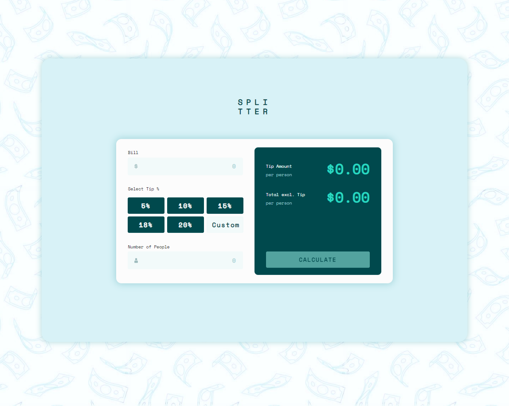
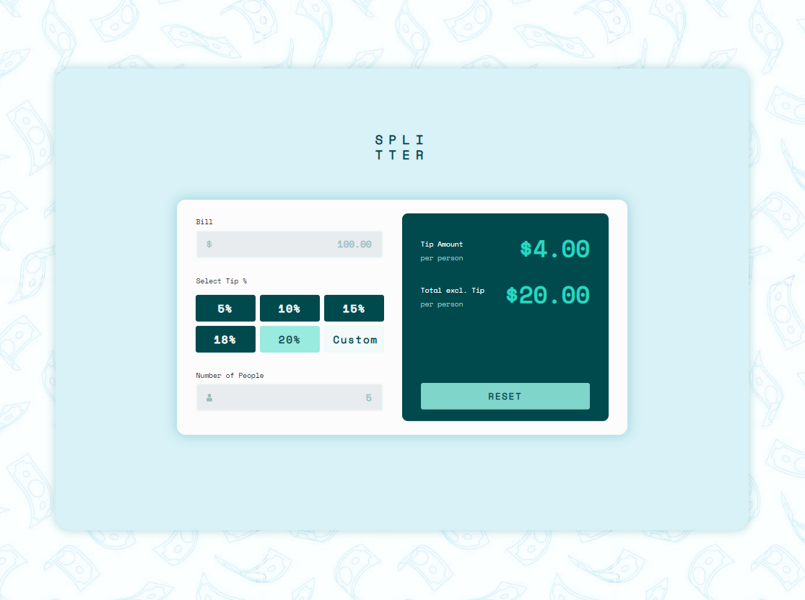
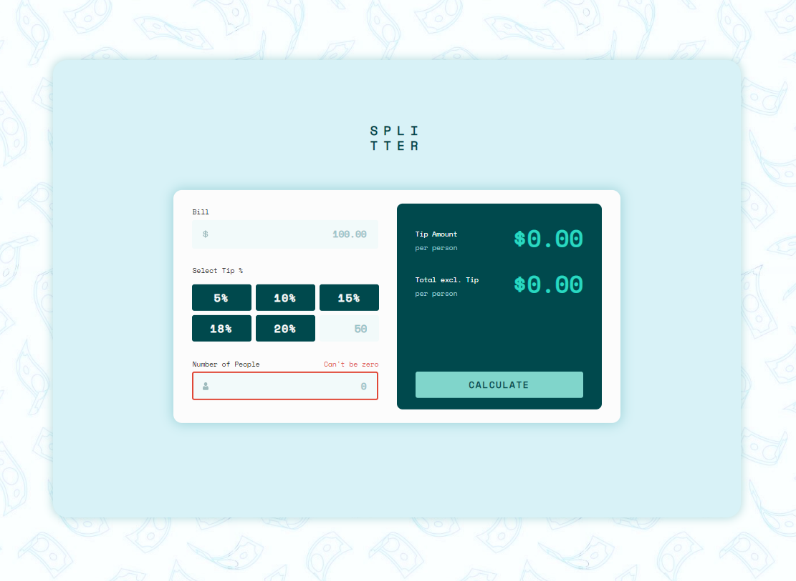

## Tip calculator - Splitter

## Table of contents

- [Overview](#overview)
  - [The challenge](#the-challenge)
  - [Screenshot](#screenshot)
  - [Links](#links)
- [My process](#my-process)
  - [Built with](#built-with)
  - [Continued development](#continued-development)
- [Author](#author)

## Overview

### The challenge

Users should be able to:

- View the optimal layout for the app depending on their device's screen size
- See hover states for all interactive elements on the page
- Calculate the correct tip and total cost of the bill per person

### Screenshot

### Links

- Live Site URL: [Splitter Live Site](https://splitter-tip-calculator.herokuapp.com/)

## My process

### Built with

- Semantic HTML5 markup
- CSS $ SASS/SCSS custom properties
- JavaScript
- Jquery
- Bootstrap
- Parcel
- Npm
- Node.js
- Hoosted on Heroku

### Continued development

While the fundamental pieces of the app have been accomplished (🎉), there are some future adjustments and additions I would like to add to enhance the experience for the User!

- Add ability to change the color scheme (EX: Seafoam / Rainbow / Petal ). This would be represented as indivisual buttons or as a dropdown with options in a header/footer that the user can switch back and forth between based on personal preference.

- To remove duplicate code and aim for a more DRY approach, build a function to iterate through an array of percentage amounts [5, 10, 15, 18, 20, custom] and return and render a button for each item.

## Author

- Website - [Portfolio](https://sangelici.github.io/)
- Frontend Mentor - [@sangelici](https://www.frontendmentor.io/profile/sangelici)
