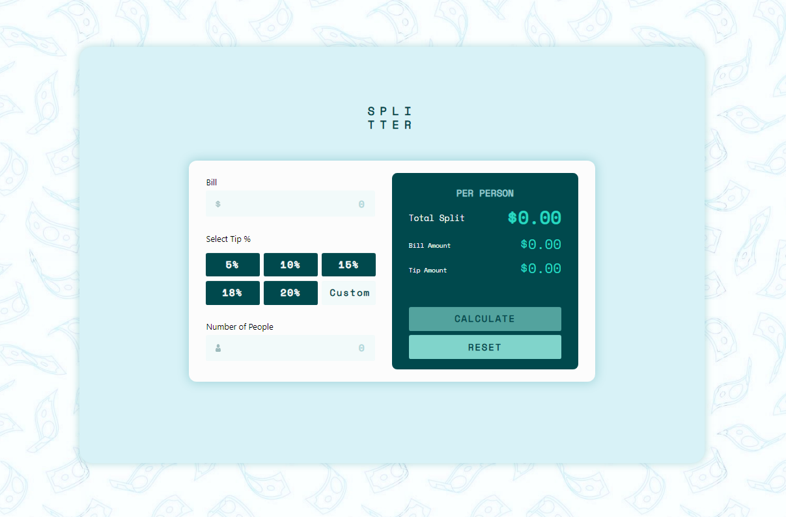
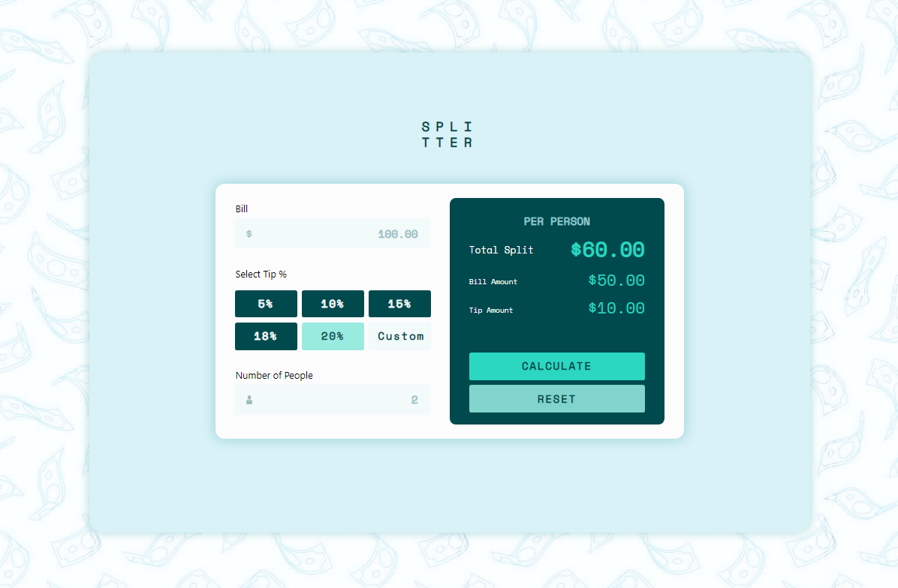
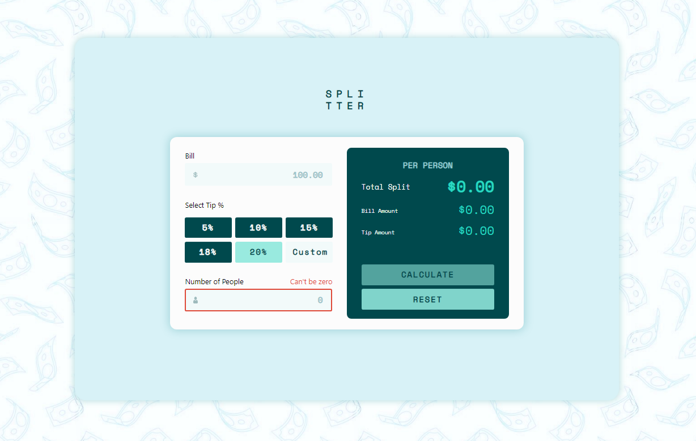
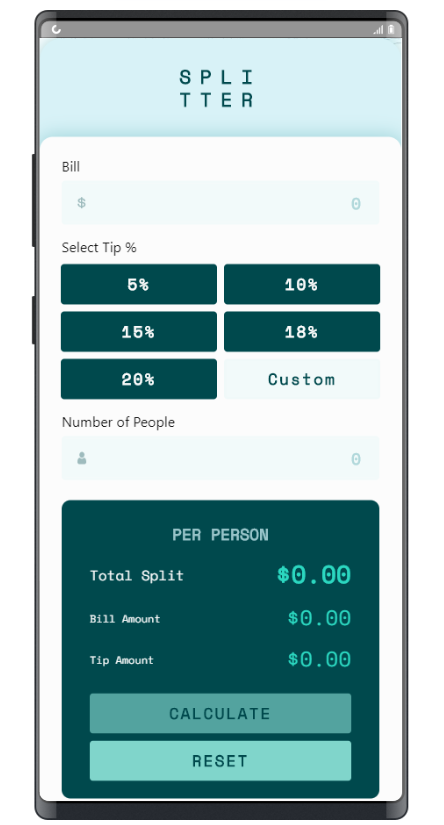

## Tip calculator - Splitter

## Table of contents

- [Overview](#overview)
  - [The Challenge](#the-challenge)
  - [App Link](#app-link)
  - [Tech Stack](#tech-stack)
  - [Screenshots](#screenshots)
- [Continued Development](#continued-development)
- [Author](#author)

## Overview

### The Challenge

Users should be able to:

- View the optimal layout for the app depending on their device's screen size
- See hover states for all interactive elements on the page
- Calculate the correct tip and total cost of the bill per person

### App Link

- Live Site URL: [Splitter Live Site](https://splitter-tip-calculator.herokuapp.com/)

### Tech Stack

- Semantic HTML5 markup
- CSS & SASS/SCSS custom properties
- JavaScript
- Jquery
- Bootstrap
- Parcel
- Npm
- Node.js
- Hosted on Heroku

### Screenshots

## Continued Development

While the fundamental pieces of the app have been accomplished (🎉), there are some future adjustments and additions I would like to add to enhance the experience for the User!

- Implement a Vemno/Cashapp third party connection so users can take the monetary data from the calculator and submit a payment request through this type of service to add further usability to the tip splitter app.
- 
- Add ability to change the color scheme (EX: Seafoam / Rainbow / Petal ). This would be represented as indivisual buttons or as a dropdown with options in a header/footer that the user can switch back and forth between based on personal preference.

## Author

- Website - [Portfolio](https://sangelici.github.io/)
- Frontend Mentor - [@sangelici](https://www.frontendmentor.io/profile/sangelici)
